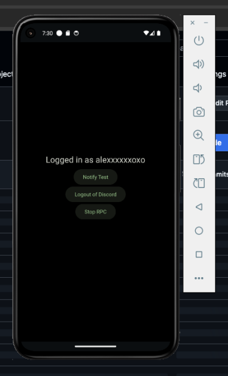

# droidblox-tools
<div align="center">



Testing components used in DroidBlox
</div>


## Why do I need to login to Discord to use RPC?
The android version of Discord currently doesn't have a way to set your presence—instead DroidBlox will connect to Discord and changes your presence just like [Kizzy](https://github.com/dead8309/Kizzy)

## WARNING!
The RPC tool that DroidBlox uses connects to Discord's gateway and uses your token which Discord doesnt allow because of "self-botting". Beware that there's a chance that your account **can get banned!**

## Building & Testing
1. Depending on your OS, you will need **OpenJDK 17** with the environment variables properly set (e.g. JAVA_HOME) and **ADB (Android Debug Bridge)**
2. Clone this repository
```sh
$ git clone https://github.com/meowstrapper/droidblox-tools
$ cd droidblox-tools
```
3. Install pip requirements
```sh
$ pip3 install -r requirements.txt
```
4. Build the APK (takes around >≈ 50 mins)
```sh
$ buildozer -v android debug # outputs apk to bin/dbtools-(VERSION)-(ARCH)-debug.apk
```
5. Install the APK
```
$ adb install bin/dbtools-(VERSION)-(ARCH)-debug.apk
```
6. Launch the APK and get the logcat output
```
$ adb logcat --pid $(adb shell pidof com.drake.dbtools)
```

# Credits
[Kizzy](https://github.com/dead8309/Kizzy) - Code refactored in python for RPC (presence) handling
