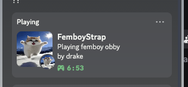

# droidblox-tools

Testing components used in DroidBlox

## Why do I need to login to Discord to use RPC?
The android version of Discord currently doesn't have a way to set your presence—instead DroidBlox will connect to Discord and changes your presence just like [Kizzy](https://github.com/dead8309/Kizzy)

## WARNING!
The RPC tool that DroidBlox uses connects to Discord's gateway and uses your token which Discord doesnt allow because of "self-botting". Beware that there's a chance that your account **can get banned!**

# Credits
[Kizzy](https://github.com/dead8309/Kizzy) - Code refactored in python for RPC (presence) handling
